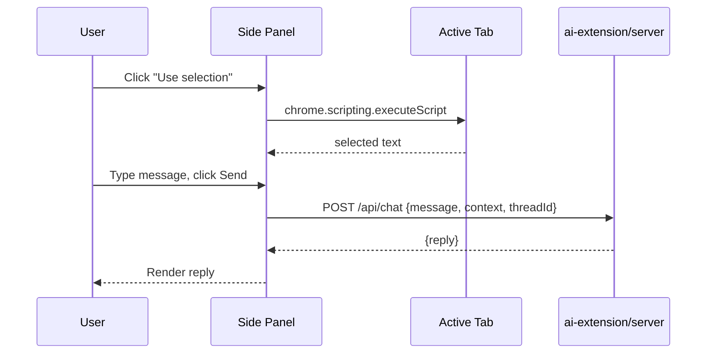

# ai-extension Implementation Plan

> **For agentic workers:** REQUIRED SUB-SKILL: Use superpowers:subagent-driven-development (recommended) or superpowers:executing-plans to implement this plan task-by-task. Steps use checkbox (`- [ ]`) syntax for tracking.

**Goal:** Build `ai-extension/` — a local Node/TypeScript agent server plus a Vue 3 Chrome (MV3) side-panel extension — so the user can chat with an AI agent about the page they're browsing, per `docs/superpowers/specs/2026-09-19-ai-extension-design.md`.

**Architecture:** `ai-extension/server` is an Express HTTP wrapper around a LangChain `createAgent` + `ChatAnthropic` agent (mirroring `whatsap/agent.ts`'s shape: file/directory/bash tools, skill-middleware, log-model-call-middleware, `MemorySaver` checkpointer keyed by `thread_id`), reachable only from the extension's own origin via a CORS allow-list. `ai-extension/extension` is a Vite + `@crxjs/vite-plugin` + Vue 3 MV3 extension whose side panel lets the user attach page selection/text as context and chat with that server.

**Tech Stack:** TypeScript (Node native TS execution, no build step, matching `whatsap/`), LangChain (`langchain`, `@langchain/anthropic`, `@langchain/langgraph`), Express, Zod, Vitest, Vue 3 + `<script setup>`, Vite, `@crxjs/vite-plugin`, Tailwind CSS, `@testing-library/vue`, Playwright.

---

## Part A — Server (`ai-extension/server`)

### Task 1: Server project scaffold

**Files:**
- Create: `ai-extension/server/package.json`
- Create: `ai-extension/server/tsconfig.json`
- Create: `ai-extension/server/.env.example`
- Create: `ai-extension/server/.gitignore`
- Create: `ai-extension/server/vitest.config.ts`
- Create: `ai-extension/server/vitest.setup.ts`

- [ ] **Step 1: Create `package.json`**

```json
{
  "name": "ai-extension-server",
  "version": "1.0.0",
  "description": "Local agent backend for the ai-extension Chrome extension",
  "main": "index.ts",
  "type": "module",
  "scripts": {
    "start": "node index.ts",
    "test": "vitest run",
    "test:watch": "vitest"
  },
  "license": "ISC",
  "packageManager": "pnpm@10.30.0",
  "dependencies": {
    "@langchain/anthropic": "^1.5.9",
    "@langchain/core": "^1.2.9",
    "@langchain/langgraph": "^1.3.0",
    "cors": "^2.8.5",
    "dotenv": "^17.4.2",
    "express": "^4.21.2",
    "langchain": "^1.4.0",
    "zod": "^4.3.6"
  },
  "devDependencies": {
    "@types/cors": "^2.8.17",
    "@types/express": "^4.17.21",
    "@types/node": "^22.10.0",
    "@types/supertest": "^6.0.2",
    "supertest": "^7.0.0",
    "typescript": "^5.7.2",
    "vitest": "^5.0.0"
  }
}
```

- [ ] **Step 2: Create `tsconfig.json`**

```json
{
  "compilerOptions": {
    "target": "ES2022",
    "module": "NodeNext",
    "moduleResolution": "NodeNext",
    "strict": true,
    "esModuleInterop": true,
    "skipLibCheck": true,
    "resolveJsonModule": true,
    "types": ["node"]
  }
}
```

- [ ] **Step 3: Create `.env.example`**

```
ANTHROPIC_API_KEY=
ANTHROPIC_MODEL=claude-sonnet-5
# Set after loading the unpacked extension in chrome://extensions — see
# docs/user-guides/config.md. The extension's manifest pins a "key" field so
# this ID is stable across rebuilds.
EXTENSION_ID=
PORT=4100
# Max characters of attached page/selection context sent to the agent per
# message; longer context is truncated with a note (see context.ts).
MAX_CONTEXT_CHARS=20000
```

- [ ] **Step 4: Create `.gitignore`**

```
node_modules/
.env
*.log
```

- [ ] **Step 5: Create `vitest.config.ts`**

```typescript
import { defineConfig } from "vitest/config";

export default defineConfig({
    test: {
        setupFiles: ["./vitest.setup.ts"],
    },
});
```

- [ ] **Step 6: Create `vitest.setup.ts`**

```typescript
// agent.ts throws at import time if ANTHROPIC_MODEL isn't set. Tests that
// only exercise pure logic (context.ts, frontmatter.ts) transitively import
// it through http.ts/agent.ts, so default it here — same pattern as
// whatsap/vitest.setup.ts.
process.env.ANTHROPIC_MODEL ||= "test-model";
process.env.ANTHROPIC_API_KEY ||= "test-key";
process.env.EXTENSION_ID ||= "test-extension-id";
```

- [ ] **Step 7: Install dependencies**

Run: `cd ai-extension/server && pnpm install`
Expected: lockfile created, no errors.

- [ ] **Step 8: Commit**

```bash
git add ai-extension/server/package.json ai-extension/server/tsconfig.json \
  ai-extension/server/.env.example ai-extension/server/.gitignore \
  ai-extension/server/vitest.config.ts ai-extension/server/vitest.setup.ts \
  ai-extension/server/pnpm-lock.yaml
git commit -m "config: scaffold ai-extension/server project"
```

---

### Task 2: Context truncation logic

**Files:**
- Create: `ai-extension/server/context.ts`
- Test: `ai-extension/server/context.test.ts`

- [ ] **Step 1: Write the failing tests**

```typescript
// ai-extension/server/context.test.ts
import { describe, it, expect } from "vitest";
import { formatContext, type PageContext } from "./context.ts";

describe("formatContext", () => {
    it("returns undefined when there is no context", () => {
        expect(formatContext(undefined, 100)).toBeUndefined();
    });

    it("formats a selection context under the limit", () => {
        const context: PageContext = { type: "selection", text: "Hello world", url: "https://example.com" };
        const result = formatContext(context, 100);
        expect(result).toContain("Selected text from https://example.com");
        expect(result).toContain("Hello world");
    });

    it("formats a full-page context under the limit", () => {
        const context: PageContext = { type: "page", text: "Page body text", url: "https://example.com/a" };
        const result = formatContext(context, 100);
        expect(result).toContain("Full page text from https://example.com/a");
        expect(result).toContain("Page body text");
    });

    it("truncates text longer than the max and notes it was truncated", () => {
        const context: PageContext = { type: "page", text: "x".repeat(50), url: "https://example.com" };
        const result = formatContext(context, 10)!;
        expect(result).toContain("x".repeat(10));
        expect(result).not.toContain("x".repeat(11));
        expect(result).toContain("[truncated:");
    });

    it("does not add a truncation note when text is exactly at the max", () => {
        const context: PageContext = { type: "page", text: "x".repeat(10), url: "https://example.com" };
        const result = formatContext(context, 10)!;
        expect(result).not.toContain("[truncated:");
    });
});
```

- [ ] **Step 2: Run tests to verify they fail**

Run: `cd ai-extension/server && npx vitest run context.test.ts`
Expected: FAIL — `Cannot find module './context.ts'`

- [ ] **Step 3: Write the implementation**

```typescript
// ai-extension/server/context.ts
export interface PageContext {
    type: "selection" | "page";
    text: string;
    url: string;
}

const LABELS: Record<PageContext["type"], string> = {
    selection: "Selected text from",
    page: "Full page text from",
};

// Formats attached page/selection context into a block prepended to the
// user's message. Returns undefined when there's no context to attach.
// Text longer than maxChars is clipped with an explicit note rather than
// silently dropped, per the design spec.
export function formatContext(context: PageContext | undefined, maxChars: number): string | undefined {
    if (!context) return undefined;

    const truncated = context.text.length > maxChars;
    const text = truncated ? context.text.slice(0, maxChars) : context.text;
    const note = truncated ? `\n[truncated: showing first ${maxChars} of ${context.text.length} characters]` : "";

    return `${LABELS[context.type]} ${context.url}:\n"""\n${text}\n"""${note}`;
}
```

- [ ] **Step 4: Run tests to verify they pass**

Run: `cd ai-extension/server && npx vitest run context.test.ts`
Expected: PASS (5 tests)

- [ ] **Step 5: Commit**

```bash
git add ai-extension/server/context.ts ai-extension/server/context.test.ts
git commit -m "feat: add page context formatting/truncation for ai-extension agent"
```

---

### Task 3: Frontmatter parsing (for skills)

**Files:**
- Create: `ai-extension/server/middleware/frontmatter.ts`
- Test: `ai-extension/server/middleware/frontmatter.test.ts`

- [ ] **Step 1: Write the failing tests**

```typescript
// ai-extension/server/middleware/frontmatter.test.ts
import { describe, it, expect } from "vitest";
import { parseFrontmatter, parseMetadataField } from "./frontmatter.ts";

describe("parseFrontmatter", () => {
    it("splits metadata and content", () => {
        const { metadata, content } = parseFrontmatter("---\nname: foo\ndescription: bar\n---\nBody text\n");
        expect(metadata).toBe("name: foo\ndescription: bar");
        expect(content).toBe("Body text\n");
    });

    it("throws when there is no leading frontmatter block", () => {
        expect(() => parseFrontmatter("no frontmatter here")).toThrow(/Invalid frontmatter/);
    });
});

describe("parseMetadataField", () => {
    it("extracts a plain field", () => {
        expect(parseMetadataField("name: foo\ndescription: bar", "name")).toBe("foo");
    });

    it("strips wrapping quotes", () => {
        expect(parseMetadataField('name: "quoted value"', "name")).toBe("quoted value");
    });

    it("returns undefined for a missing field", () => {
        expect(parseMetadataField("name: foo", "description")).toBeUndefined();
    });
});
```

- [ ] **Step 2: Run tests to verify they fail**

Run: `cd ai-extension/server && npx vitest run middleware/frontmatter.test.ts`
Expected: FAIL — module not found

- [ ] **Step 3: Write the implementation**

```typescript
// ai-extension/server/middleware/frontmatter.ts
// Same parsing rules as whatsap/middleware/frontmatter.ts — kept as this
// project's own copy per the design spec's "independent copy" decision.
export interface ParsedFrontmatter {
    metadata: string;
    content: string;
}

export function parseFrontmatter(fileText: string): ParsedFrontmatter {
    const match = fileText.match(/^---\r?\n([\s\S]*?)\r?\n---\r?\n?([\s\S]*)$/);
    if (!match) {
        throw new Error("Invalid frontmatter format: expected a leading '---' delimited block");
    }
    return { metadata: match[1], content: match[2] };
}

export function parseMetadataField(metadata: string, field: string): string | undefined {
    const line = metadata.split("\n").find((l) => l.trim().startsWith(`${field}:`));
    if (line === undefined) return undefined;
    const raw = line.trim().slice(field.length + 1).trim();
    const quoted = raw.match(/^"([^"]*)"$|^'([^']*)'$/);
    return quoted ? (quoted[1] ?? quoted[2]) : raw;
}
```

- [ ] **Step 4: Run tests to verify they pass**

Run: `cd ai-extension/server && npx vitest run middleware/frontmatter.test.ts`
Expected: PASS (5 tests)

- [ ] **Step 5: Commit**

```bash
git add ai-extension/server/middleware/frontmatter.ts ai-extension/server/middleware/frontmatter.test.ts
git commit -m "feat: add frontmatter parsing for ai-extension skill files"
```

---

### Task 4: File and directory tools

**Files:**
- Create: `ai-extension/server/tools/read-file.tool.ts`
- Create: `ai-extension/server/tools/write-file.tool.ts`
- Create: `ai-extension/server/tools/list-directory.tool.ts`
- Create: `ai-extension/server/tools/create-directory.tool.ts`
- Test: `ai-extension/server/tools/file-tools.test.ts`

- [ ] **Step 1: Write the failing tests**

```typescript
// ai-extension/server/tools/file-tools.test.ts
import { describe, it, expect, beforeEach, afterEach } from "vitest";
import fs from "node:fs/promises";
import path from "node:path";
import os from "node:os";
import { readFileTool } from "./read-file.tool.ts";
import { writeFileTool } from "./write-file.tool.ts";
import { listDirectoryTool } from "./list-directory.tool.ts";
import { createDirectoryTool } from "./create-directory.tool.ts";

let cwd: string;
let originalCwd: string;

beforeEach(async () => {
    originalCwd = process.cwd();
    cwd = await fs.mkdtemp(path.join(os.tmpdir(), "ai-extension-tools-"));
    process.chdir(cwd);
});

afterEach(async () => {
    process.chdir(originalCwd);
    await fs.rm(cwd, { recursive: true, force: true });
});

describe("writeFileTool + readFileTool", () => {
    it("writes a file and reads it back", async () => {
        await writeFileTool.invoke({ file_path: "notes/a.txt", content: "hello" });
        const contents = await readFileTool.invoke({ file_path: "notes/a.txt" });
        expect(contents).toBe("hello");
    });

    it("rejects reading a nonexistent file", async () => {
        await expect(readFileTool.invoke({ file_path: "missing.txt" })).rejects.toThrow();
    });
});

describe("createDirectoryTool + listDirectoryTool", () => {
    it("creates a directory and lists its (empty) contents", async () => {
        await createDirectoryTool.invoke({ directoryPath: "sub" });
        const entries = await listDirectoryTool.invoke({ directoryPath: "sub" });
        expect(entries).toEqual([]);
    });

    it("lists files sorted", async () => {
        await writeFileTool.invoke({ file_path: "b.txt", content: "" });
        await writeFileTool.invoke({ file_path: "a.txt", content: "" });
        const entries = await listDirectoryTool.invoke({ directoryPath: "." });
        expect(entries).toEqual(["a.txt", "b.txt"]);
    });

    it("rejects listing a nonexistent directory", async () => {
        await expect(listDirectoryTool.invoke({ directoryPath: "nope" })).rejects.toThrow();
    });
});
```

- [ ] **Step 2: Run tests to verify they fail**

Run: `cd ai-extension/server && npx vitest run tools/file-tools.test.ts`
Expected: FAIL — modules not found

- [ ] **Step 3: Write the implementations**

```typescript
// ai-extension/server/tools/read-file.tool.ts
import { tool } from "langchain";
import { z } from "zod";
import fs from "node:fs/promises";
import path from "node:path";

export const readFileTool = tool(
    async ({ file_path }) => {
        const fullPath = path.resolve(process.cwd(), file_path);
        return fs.readFile(fullPath, "utf-8");
    },
    {
        name: "my_read_file",
        description: "Read a file, relative to the server's working directory, and return its content.",
        schema: z.object({
            file_path: z.string(),
        }),
    }
);
```

```typescript
// ai-extension/server/tools/write-file.tool.ts
import { tool } from "langchain";
import { z } from "zod";
import fs from "node:fs/promises";
import path from "node:path";

export const writeFileTool = tool(
    async ({ file_path, content }) => {
        const fullPath = path.resolve(process.cwd(), file_path);
        await fs.mkdir(path.dirname(fullPath), { recursive: true });
        await fs.writeFile(fullPath, content, "utf-8");
        return `Successfully wrote to file: ${file_path}`;
    },
    {
        name: "my_write_file",
        description: "Write content to a file, relative to the server's working directory — the file (and any missing parent directories) is created there.",
        schema: z.object({
            file_path: z.string(),
            content: z.string(),
        }),
    }
);
```

```typescript
// ai-extension/server/tools/list-directory.tool.ts
import { tool } from "langchain";
import { z } from "zod";
import { existsSync, statSync, readdirSync } from "node:fs";
import path from "node:path";

export const listDirectoryTool = tool(
    async ({ directoryPath }) => {
        const fullPath = path.resolve(process.cwd(), directoryPath);
        if (!existsSync(fullPath)) {
            throw new Error(`Directory does not exist: ${directoryPath}`);
        }
        if (!statSync(fullPath).isDirectory()) {
            throw new Error(`Path is not a directory: ${directoryPath}`);
        }
        return readdirSync(fullPath).sort();
    },
    {
        name: "list_directory",
        description: "List all files and subdirectories in a given directory, relative to the server's working directory.",
        schema: z.object({
            directoryPath: z.string().describe("Path to the directory to list files from"),
        }),
    }
);
```

```typescript
// ai-extension/server/tools/create-directory.tool.ts
import { tool } from "langchain";
import { z } from "zod";
import fs from "node:fs/promises";
import path from "node:path";

export const createDirectoryTool = tool(
    async ({ directoryPath }) => {
        const fullPath = path.resolve(process.cwd(), directoryPath);
        await fs.mkdir(fullPath, { recursive: true });
        return `Successfully created directory: ${directoryPath}`;
    },
    {
        name: "create_directory",
        description: "Create a directory, relative to the server's working directory.",
        schema: z.object({
            directoryPath: z.string(),
        }),
    }
);
```

- [ ] **Step 4: Run tests to verify they pass**

Run: `cd ai-extension/server && npx vitest run tools/file-tools.test.ts`
Expected: PASS (5 tests)

- [ ] **Step 5: Commit**

```bash
git add ai-extension/server/tools/read-file.tool.ts ai-extension/server/tools/write-file.tool.ts \
  ai-extension/server/tools/list-directory.tool.ts ai-extension/server/tools/create-directory.tool.ts \
  ai-extension/server/tools/file-tools.test.ts
git commit -m "feat: add file/directory tools for ai-extension agent"
```

---

### Task 5: Bash tool

**Files:**
- Create: `ai-extension/server/tools/execute-bash.tool.ts`
- Test: `ai-extension/server/tools/execute-bash.tool.test.ts`

- [ ] **Step 1: Write the failing test**

```typescript
// ai-extension/server/tools/execute-bash.tool.test.ts
import { describe, it, expect } from "vitest";
import { executeBashTool } from "./execute-bash.tool.ts";

describe("executeBashTool", () => {
    it("runs a command and returns stdout", async () => {
        const output = await executeBashTool.invoke({ command: "echo hello-from-bash" });
        expect(output).toContain("hello-from-bash");
    });

    it("returns stderr output for a failing command", async () => {
        await expect(executeBashTool.invoke({ command: "exit 1" })).rejects.toBeTruthy();
    });
});
```

- [ ] **Step 2: Run test to verify it fails**

Run: `cd ai-extension/server && npx vitest run tools/execute-bash.tool.test.ts`
Expected: FAIL — module not found

- [ ] **Step 3: Write the implementation**

```typescript
// ai-extension/server/tools/execute-bash.tool.ts
import { tool } from "langchain";
import { z } from "zod";
import { exec } from "node:child_process";

export const executeBashTool = tool(
    ({ command }) => {
        return new Promise<string>((resolve, reject) => {
            exec(command, { maxBuffer: 10 * 1024 * 1024 }, (error, stdout, stderr) => {
                if (error) {
                    reject(stderr || error.message);
                    return;
                }
                resolve(stderr ? `${stderr}\n${stdout}` : stdout);
            });
        });
    },
    {
        name: "execute_bash",
        description: "Executes a bash command in the server's working directory and returns the output.",
        schema: z.object({
            command: z.string().describe("The bash command to execute"),
        }),
    }
);
```

- [ ] **Step 4: Run test to verify it passes**

Run: `cd ai-extension/server && npx vitest run tools/execute-bash.tool.test.ts`
Expected: PASS (2 tests)

- [ ] **Step 5: Commit**

```bash
git add ai-extension/server/tools/execute-bash.tool.ts ai-extension/server/tools/execute-bash.tool.test.ts
git commit -m "feat: add bash tool for ai-extension agent"
```

---

### Task 6: Skill middleware and the critique-text skill

**Files:**
- Create: `ai-extension/server/middleware/skill-middleware.ts`
- Create: `ai-extension/server/skills/critique-text/SKILL.md`
- Test: `ai-extension/server/middleware/skill-middleware.test.ts`

- [ ] **Step 1: Write the failing tests**

```typescript
// ai-extension/server/middleware/skill-middleware.test.ts
import { describe, it, expect, beforeEach, afterEach } from "vitest";
import fs from "node:fs/promises";
import path from "node:path";
import os from "node:os";
import { loadSkills } from "./skill-middleware.ts";

let cwd: string;
let originalCwd: string;

beforeEach(async () => {
    originalCwd = process.cwd();
    cwd = await fs.mkdtemp(path.join(os.tmpdir(), "ai-extension-skills-"));
    process.chdir(cwd);
});

afterEach(async () => {
    process.chdir(originalCwd);
    await fs.rm(cwd, { recursive: true, force: true });
});

describe("loadSkills", () => {
    it("returns [] when ./skills doesn't exist", () => {
        expect(loadSkills()).toEqual([]);
    });

    it("loads a skill from a SKILL.md with valid frontmatter", async () => {
        await fs.mkdir("skills/example", { recursive: true });
        await fs.writeFile(
            "skills/example/SKILL.md",
            "---\nname: example\ndescription: An example skill\n---\nSkill body text\n"
        );
        const skills = loadSkills();
        expect(skills).toEqual([{ name: "example", description: "An example skill", content: "Skill body text\n" }]);
    });

    it("throws when a SKILL.md is missing name or description", async () => {
        await fs.mkdir("skills/broken", { recursive: true });
        await fs.writeFile("skills/broken/SKILL.md", "---\nname: broken\n---\nBody\n");
        expect(() => loadSkills()).toThrow(/missing name or description/);
    });
});
```

- [ ] **Step 2: Run tests to verify they fail**

Run: `cd ai-extension/server && npx vitest run middleware/skill-middleware.test.ts`
Expected: FAIL — module not found

- [ ] **Step 3: Write the implementation**

```typescript
// ai-extension/server/middleware/skill-middleware.ts
// Progressive-disclosure skill system for this agent, mirroring
// whatsap/middleware/skill-middleware.ts's shape (own copy, see the design
// spec's "independent copy" decision) but without the multi-agent
// allowedSkills/extraDirs layering whatsap needs — this server has exactly
// one agent instance.
import { createMiddleware, tool } from "langchain";
import { z } from "zod";
import fs from "node:fs";
import path from "node:path";
import { parseFrontmatter, parseMetadataField } from "./frontmatter.ts";

export interface Skill {
    name: string;
    description: string;
    content: string;
}

export function loadSkills(directoryPath = "./skills"): Skill[] {
    if (!fs.existsSync(directoryPath)) {
        return [];
    }

    const entries = fs.readdirSync(directoryPath);
    const skillFiles = entries
        .map((entry) => path.join(directoryPath, entry, "SKILL.md"))
        .filter((filePath) => fs.existsSync(filePath));

    return skillFiles.map((filePath) => {
        const fileText = fs.readFileSync(filePath, "utf-8");
        const { metadata, content } = parseFrontmatter(fileText);
        const name = parseMetadataField(metadata, "name");
        const description = parseMetadataField(metadata, "description");
        if (!name || !description) {
            throw new Error(`Invalid skill metadata in ${filePath}: missing name or description`);
        }
        return { name, description, content };
    });
}

function buildSkillMiddleware(skills: Skill[]) {
    const loadSkill = tool(
        async ({ skillName }) => {
            const skill = skills.find((s) => s.name === skillName);
            if (skill) {
                return `Loaded skill: ${skillName}\n\n${skill.content}`;
            }
            const available = skills.map((s) => s.name).join(", ");
            return `Skill '${skillName}' not found. Available skills: ${available}`;
        },
        {
            name: "load_skill",
            description: "Load the full content of a skill into the agent's context. Use this when a request matches one of the skills listed in the system prompt's Available Skills section.",
            schema: z.object({
                skillName: z.string().describe("The name of the skill to load"),
            }),
        }
    );

    const skillsPrompt = skills.map((skill) => `- **${skill.name}**: ${skill.description}`).join("\n");

    return createMiddleware({
        name: "skillMiddleware",
        tools: [loadSkill],
        wrapModelCall: async (request, handler) => {
            const skillsAddendum =
                `\n\n## Available Skills\n\n${skillsPrompt}\n\n` +
                "Use the load_skill tool when you need detailed information about handling a specific type of request.";
            return handler({
                ...request,
                systemMessage: request.systemMessage.concat(skillsAddendum),
            });
        },
    });
}

export const skillMiddleware = buildSkillMiddleware(loadSkills());
```

- [ ] **Step 4: Create the critique-text skill**

```markdown
---
name: critique-text
description: Critically review text from a web page — arguments, evidence, clarity, and bias. Use when the user asks to review, critique, fact-check, or find flaws in selected or full-page text.
---

# Critique Text Skill

Use this when the user attaches page/selection context and asks for a critical review,
fact-check, or general opinion of the text.

## Approach

1. Identify the text's main claim(s) or purpose.
2. Evaluate:
   - **Argument structure** — is the reasoning sound? Any logical fallacies or unsupported leaps?
   - **Evidence** — are claims backed by data, citations, or examples? Is the evidence current and relevant?
   - **Clarity** — is the writing clear, or vague/ambiguous in ways that matter?
   - **Bias/framing** — does the text present one side, omit context, or use loaded language?
3. Structure the response as: a one-sentence summary of what the text argues, followed by
   specific strengths, specific weaknesses (quote or point to the exact part of the text),
   and (if asked) a verdict or recommendation.
4. Be specific — vague feedback like "could be clearer" is not useful; point to the exact
   sentence or claim and say what's wrong with it.
5. If no context was attached and the user's message doesn't include the text to review,
   ask them to select the text or use the "Use page" button before proceeding.
```

- [ ] **Step 5: Run tests to verify they pass**

Run: `cd ai-extension/server && npx vitest run middleware/skill-middleware.test.ts`
Expected: PASS (3 tests)

- [ ] **Step 6: Commit**

```bash
git add ai-extension/server/middleware/skill-middleware.ts ai-extension/server/middleware/skill-middleware.test.ts \
  ai-extension/server/skills/critique-text/SKILL.md
git commit -m "feat: add skill middleware and critique-text skill for ai-extension agent"
```

---

### Task 7: Log-model-call middleware and system prompt

**Files:**
- Create: `ai-extension/server/middleware/log-model-call-middleware.ts`
- Create: `ai-extension/server/prompts/executer-system.md`

- [ ] **Step 1: Create the logging middleware**

```typescript
// ai-extension/server/middleware/log-model-call-middleware.ts
import { createMiddleware } from "langchain";

export const logModelCallMiddleware = createMiddleware({
    name: "LoggingMiddleware",
    beforeModel: (state) => {
        console.log(`[ai-extension] calling model with ${state.messages.length} messages`);
    },
    afterModel: (state) => {
        const lastMessage = state.messages[state.messages.length - 1];
        console.log(`[ai-extension] model returned: ${JSON.stringify(lastMessage.content).slice(0, 500)}`);
    },
});
```

- [ ] **Step 2: Create the system prompt**

```markdown
# ai-extension Assistant

You are an assistant embedded in a Chrome extension's side panel. The user is browsing the
web and may attach the current page's selected text or full page text as context to their
message (shown to you as a block starting with "Selected text from <url>:" or "Full page
text from <url>:").

## Workflow
1. If the user's message references "this text", "this page", or similar without attached
   context, ask them to select text or use the "Use page" button first.
2. Check whether the request matches one of the skills listed under "Available Skills" below
   (e.g. critically reviewing attached text) before answering from general knowledge.
3. Answer directly and specifically — quote or point to the exact part of any attached text
   you're commenting on rather than speaking in generalities.
4. You also have file, directory, and bash tools, scoped to this server's own working
   directory — use them only if the user's request explicitly needs local file or shell
   access (e.g. saving notes); they are not needed for reviewing page text.
```

- [ ] **Step 3: Commit**

```bash
git add ai-extension/server/middleware/log-model-call-middleware.ts ai-extension/server/prompts/executer-system.md
git commit -m "feat: add logging middleware and system prompt for ai-extension agent"
```

---

### Task 8: The agent

**Files:**
- Create: `ai-extension/server/agent.ts`

- [ ] **Step 1: Write the implementation**

```typescript
// ai-extension/server/agent.ts
import "dotenv/config";
import { createAgent } from "langchain";
import { ChatAnthropic } from "@langchain/anthropic";
import { MemorySaver } from "@langchain/langgraph";
import { HumanMessage, SystemMessage } from "@langchain/core/messages";
import { readFileSync } from "node:fs";

import { readFileTool } from "./tools/read-file.tool.ts";
import { writeFileTool } from "./tools/write-file.tool.ts";
import { listDirectoryTool } from "./tools/list-directory.tool.ts";
import { createDirectoryTool } from "./tools/create-directory.tool.ts";
import { executeBashTool } from "./tools/execute-bash.tool.ts";
import { skillMiddleware } from "./middleware/skill-middleware.ts";
import { logModelCallMiddleware } from "./middleware/log-model-call-middleware.ts";

if (!process.env.ANTHROPIC_MODEL) {
    throw new Error("ANTHROPIC_MODEL environment variable is required (e.g. claude-sonnet-5)");
}

const model = new ChatAnthropic({
    model: process.env.ANTHROPIC_MODEL,
    temperature: 0,
    maxRetries: 2,
});

const systemPrompt = readFileSync(new URL("./prompts/executer-system.md", import.meta.url), "utf-8");
const checkpointer = new MemorySaver();

const agent = createAgent({
    model,
    tools: [readFileTool, writeFileTool, listDirectoryTool, createDirectoryTool, executeBashTool],
    checkpointer,
    systemPrompt: new SystemMessage(systemPrompt),
    middleware: [skillMiddleware, logModelCallMiddleware],
});

function extractText(content: string | Array<{ type: string; text?: string }>): string {
    if (typeof content === "string") return content;
    return content
        .filter((block): block is { type: "text"; text: string } => block.type === "text")
        .map((block) => block.text)
        .join("\n");
}

// message is the user's chat text, already combined with any formatted page
// context (see context.ts) by the http layer before this is called.
export async function callAgent(message: string, threadId: string): Promise<string> {
    const result = await agent.invoke(
        { messages: [new HumanMessage(message)] },
        { recursionLimit: 100, configurable: { thread_id: threadId } }
    );
    const { messages } = result;
    return extractText(messages[messages.length - 1].content);
}
```

- [ ] **Step 2: Commit**

```bash
git add ai-extension/server/agent.ts
git commit -m "feat: add ai-extension chat agent"
```

---

### Task 9: HTTP server (CORS + /api/chat + /health)

**Files:**
- Create: `ai-extension/server/http.ts`
- Test: `ai-extension/server/http.test.ts`

- [ ] **Step 1: Write the failing tests**

```typescript
// ai-extension/server/http.test.ts
import { describe, it, expect, vi, beforeEach } from "vitest";
import request from "supertest";

vi.mock("./agent.ts", () => ({
    callAgent: vi.fn(async (message: string) => `echo: ${message}`),
}));

import { createApp } from "./http.ts";
import { callAgent } from "./agent.ts";

const EXTENSION_ORIGIN = "chrome-extension://test-extension-id";

beforeEach(() => {
    vi.mocked(callAgent).mockClear();
});

describe("GET /health", () => {
    it("returns ok", async () => {
        const app = createApp({ extensionId: "test-extension-id", maxContextChars: 1000 });
        const res = await request(app).get("/health");
        expect(res.status).toBe(200);
        expect(res.body).toEqual({ status: "ok" });
    });
});

describe("POST /api/chat", () => {
    it("rejects requests from a different origin", async () => {
        const app = createApp({ extensionId: "test-extension-id", maxContextChars: 1000 });
        const res = await request(app)
            .post("/api/chat")
            .set("Origin", "chrome-extension://some-other-id")
            .send({ message: "hi", threadId: "t1" });
        expect(res.status).toBe(403);
    });

    it("accepts requests from the configured extension origin and returns the agent's reply", async () => {
        const app = createApp({ extensionId: "test-extension-id", maxContextChars: 1000 });
        const res = await request(app)
            .post("/api/chat")
            .set("Origin", EXTENSION_ORIGIN)
            .send({ message: "hi", threadId: "t1" });
        expect(res.status).toBe(200);
        expect(res.body).toEqual({ reply: "echo: hi" });
    });

    it("prepends formatted context to the message sent to the agent", async () => {
        const app = createApp({ extensionId: "test-extension-id", maxContextChars: 1000 });
        await request(app)
            .post("/api/chat")
            .set("Origin", EXTENSION_ORIGIN)
            .send({
                message: "review this",
                threadId: "t1",
                context: { type: "selection", text: "some page text", url: "https://example.com" },
            });
        const [sentMessage] = vi.mocked(callAgent).mock.calls[0];
        expect(sentMessage).toContain("some page text");
        expect(sentMessage).toContain("review this");
    });

    it("returns 400 when message is missing", async () => {
        const app = createApp({ extensionId: "test-extension-id", maxContextChars: 1000 });
        const res = await request(app)
            .post("/api/chat")
            .set("Origin", EXTENSION_ORIGIN)
            .send({ threadId: "t1" });
        expect(res.status).toBe(400);
    });

    it("returns 400 when threadId is missing", async () => {
        const app = createApp({ extensionId: "test-extension-id", maxContextChars: 1000 });
        const res = await request(app)
            .post("/api/chat")
            .set("Origin", EXTENSION_ORIGIN)
            .send({ message: "hi" });
        expect(res.status).toBe(400);
    });
});
```

- [ ] **Step 2: Run tests to verify they fail**

Run: `cd ai-extension/server && npx vitest run http.test.ts`
Expected: FAIL — `./http.ts` not found

- [ ] **Step 3: Write the implementation**

```typescript
// ai-extension/server/http.ts
import express, { type Express } from "express";
import cors from "cors";
import { z } from "zod";
import { callAgent } from "./agent.ts";
import { formatContext, type PageContext } from "./context.ts";

const chatRequestSchema = z.object({
    message: z.string().min(1),
    threadId: z.string().min(1),
    context: z
        .object({
            type: z.enum(["selection", "page"]),
            text: z.string(),
            url: z.string(),
        })
        .optional(),
});

export interface AppConfig {
    extensionId: string;
    maxContextChars: number;
}

export function createApp({ extensionId, maxContextChars }: AppConfig): Express {
    const app = express();
    app.use(express.json());
    app.use(
        cors({
            origin: `chrome-extension://${extensionId}`,
        })
    );

    app.get("/health", (_req, res) => {
        res.json({ status: "ok" });
    });

    app.post("/api/chat", async (req, res) => {
        const parsed = chatRequestSchema.safeParse(req.body);
        if (!parsed.success) {
            res.status(400).json({ error: parsed.error.message });
            return;
        }

        const { message, threadId, context } = parsed.data;
        const formatted = formatContext(context as PageContext | undefined, maxContextChars);
        const fullMessage = formatted ? `${formatted}\n\n${message}` : message;

        try {
            const reply = await callAgent(fullMessage, threadId);
            res.json({ reply });
        } catch (error) {
            console.error("[ai-extension] agent call failed:", error);
            res.status(500).json({ error: "Agent call failed" });
        }
    });

    return app;
}
```

- [ ] **Step 4: Run tests to verify they pass**

Run: `cd ai-extension/server && npx vitest run http.test.ts`
Expected: PASS (6 tests)

Note: the CORS rejection returns a CORS error the `cors` package surfaces as a thrown
error reaching Express's default error handler, which responds 500 by default — add an
error-handling middleware in this step if the first test run shows 500 instead of 403:

```typescript
// append in createApp, after the routes:
app.use((err: Error, _req: express.Request, res: express.Response, _next: express.NextFunction) => {
    if (err.message === "Not allowed by CORS") {
        res.status(403).json({ error: "Forbidden" });
        return;
    }
    res.status(500).json({ error: "Internal error" });
});
```

- [ ] **Step 5: Commit**

```bash
git add ai-extension/server/http.ts ai-extension/server/http.test.ts
git commit -m "feat: add HTTP server with CORS-restricted /api/chat endpoint"
```

---

### Task 10: Entrypoint

**Files:**
- Create: `ai-extension/server/index.ts`

- [ ] **Step 1: Write the implementation**

```typescript
// ai-extension/server/index.ts
import "dotenv/config";
import { createApp } from "./http.ts";

const extensionId = process.env.EXTENSION_ID;
if (!extensionId) {
    throw new Error("EXTENSION_ID environment variable is required — see .env.example");
}

const port = process.env.PORT ? Number(process.env.PORT) : 4100;
const maxContextChars = process.env.MAX_CONTEXT_CHARS ? Number(process.env.MAX_CONTEXT_CHARS) : 20000;

const app = createApp({ extensionId, maxContextChars });
app.listen(port, () => {
    console.log(`[ai-extension] server listening on http://localhost:${port}`);
});
```

- [ ] **Step 2: Verify it starts (requires a real or placeholder `.env`)**

Run: `cd ai-extension/server && cp .env.example .env && ANTHROPIC_API_KEY=test EXTENSION_ID=test node index.ts`
Expected: prints `[ai-extension] server listening on http://localhost:4100`; stop with Ctrl-C.

- [ ] **Step 3: Commit**

```bash
git add ai-extension/server/index.ts
git commit -m "feat: add ai-extension server entrypoint"
```

---

### Task 11: Server documentation

**Files:**
- Create: `ai-extension/server/CLAUDE.md`

- [ ] **Step 1: Write the file**

```markdown
# CLAUDE.md

Guidance for Claude Code when working in `ai-extension/server`.

## What this is

A local Express HTTP server wrapping a LangChain `createAgent` + `ChatAnthropic` agent —
the backend for the `ai-extension` Chrome extension's side-panel chat. Same agent shape as
`whatsap/agent.ts` (file/directory/bash tools, skill-middleware, `MemorySaver` checkpointer)
but its own independent instance — see
`docs/superpowers/specs/2026-09-19-ai-extension-design.md` for why.

## Commands

- Install: `pnpm install`
- Run: `node index.ts` (no build step, Node native TS execution)
- Test: `pnpm test` (`vitest run`) / `pnpm test:watch`
- Requires `ANTHROPIC_API_KEY`, `ANTHROPIC_MODEL`, and `EXTENSION_ID` set (see `.env.example`)
  — `index.ts` throws at startup if `EXTENSION_ID` is missing, `agent.ts` throws if
  `ANTHROPIC_MODEL` is missing.

## Architecture

- `agent.ts` — the LangChain agent: `ChatAnthropic` model, file/directory/bash tools,
  `skillMiddleware`, `logModelCallMiddleware`, `MemorySaver` checkpointer keyed by the
  `threadId` the extension sends.
- `context.ts` — formats/truncates page-selection or full-page-text context (from the
  extension) into the block prepended to the user's message.
- `http.ts` — `createApp()` builds the Express app: CORS restricted to
  `chrome-extension://<EXTENSION_ID>`, `GET /health`, `POST /api/chat`.
- `tools/*.tool.ts` — LangChain tools, paths resolved against this server's own working
  directory (not the whole repo).
- `middleware/skill-middleware.ts` + `skills/*/SKILL.md` — progressive-disclosure skill
  system, same pattern as whatsap's own (own copy, not shared).

## Security note

This server has file/bash tool access and is reachable over localhost HTTP. It is guarded
only by the `Origin` CORS check (no auth token) — acceptable for a single local user, per
the design spec's explicit risk tradeoff. Do not expose this port beyond localhost.
```

- [ ] **Step 2: Commit**

```bash
git add ai-extension/server/CLAUDE.md
git commit -m "docs: add CLAUDE.md for ai-extension/server"
```

---

## Part B — Extension (`ai-extension/extension`)

### Task 12: Extension project scaffold

**Files:**
- Create: `ai-extension/extension/package.json`
- Create: `ai-extension/extension/tsconfig.json`
- Create: `ai-extension/extension/vite.config.ts`
- Create: `ai-extension/extension/manifest.config.ts`
- Create: `ai-extension/extension/tailwind.config.ts`
- Create: `ai-extension/extension/postcss.config.js`
- Create: `ai-extension/extension/index.html`
- Create: `ai-extension/extension/.gitignore`

- [ ] **Step 1: Create `package.json`**

```json
{
  "name": "ai-extension",
  "version": "1.0.0",
  "description": "Chrome extension for chatting with an AI agent about the current page",
  "type": "module",
  "scripts": {
    "dev": "vite",
    "build": "vue-tsc --noEmit && vite build",
    "test": "vitest run",
    "test:watch": "vitest",
    "test:e2e": "playwright test"
  },
  "dependencies": {
    "vue": "^3.5.13"
  },
  "devDependencies": {
    "@crxjs/vite-plugin": "^2.0.0-beta.31",
    "@playwright/test": "^1.49.0",
    "@testing-library/jest-dom": "^6.6.3",
    "@testing-library/vue": "^8.1.0",
    "@types/chrome": "^0.0.287",
    "@vitejs/plugin-vue": "^5.2.1",
    "@vue/test-utils": "^2.4.6",
    "autoprefixer": "^10.4.20",
    "jsdom": "^25.0.1",
    "postcss": "^8.4.49",
    "tailwindcss": "^3.4.15",
    "typescript": "^5.7.2",
    "vite": "^6.0.1",
    "vitest": "^5.0.0",
    "vue-tsc": "^2.1.10"
  }
}
```

- [ ] **Step 2: Create `tsconfig.json`**

```json
{
  "compilerOptions": {
    "target": "ES2022",
    "module": "ESNext",
    "moduleResolution": "Bundler",
    "strict": true,
    "jsx": "preserve",
    "esModuleInterop": true,
    "skipLibCheck": true,
    "types": ["chrome", "vite/client"]
  },
  "include": ["src"]
}
```

- [ ] **Step 3: Create `manifest.config.ts`**

```typescript
import { defineManifest } from "@crxjs/vite-plugin";

export default defineManifest({
    manifest_version: 3,
    name: "AI Page Assistant",
    version: "1.0.0",
    description: "Chat with an AI agent about the page you're browsing.",
    // Pins the extension's ID across rebuilds (chrome-extension://<id from this key>),
    // so ai-extension/server's EXTENSION_ID CORS allow-list doesn't change on every
    // `npm run build`. Generate your own with `openssl genrsa 2048 | openssl rsa -pubout`
    // and base64-encode the DER public key — see docs/user-guides/config.md.
    key: "REPLACE_WITH_YOUR_OWN_PUBLIC_KEY",
    permissions: ["sidePanel", "activeTab", "scripting", "storage"],
    background: {
        service_worker: "src/background/service-worker.ts",
        type: "module",
    },
    side_panel: {
        default_path: "src/sidepanel/index.html",
    },
    action: {},
});
```

- [ ] **Step 4: Create `vite.config.ts`**

```typescript
import { defineConfig } from "vite";
import vue from "@vitejs/plugin-vue";
import { crx } from "@crxjs/vite-plugin";
import manifest from "./manifest.config.ts";

export default defineConfig({
    plugins: [vue(), crx({ manifest })],
});
```

- [ ] **Step 5: Create `tailwind.config.ts`**

```typescript
import type { Config } from "tailwindcss";

export default {
    content: ["./src/**/*.{vue,ts}", "./src/sidepanel/index.html"],
    theme: { extend: {} },
    plugins: [],
} satisfies Config;
```

- [ ] **Step 6: Create `postcss.config.js`**

```javascript
export default {
    plugins: {
        tailwindcss: {},
        autoprefixer: {},
    },
};
```

- [ ] **Step 7: Create the side panel's `index.html`**

```
ai-extension/extension/src/sidepanel/index.html
```

```html
<!doctype html>
<html lang="en">
  <head>
    <meta charset="UTF-8" />
    <title>AI Page Assistant</title>
    <link rel="stylesheet" href="./style.css" />
  </head>
  <body class="h-full">
    <div id="app" class="h-full"></div>
    <script type="module" src="./main.ts"></script>
  </body>
</html>
```

- [ ] **Step 8: Create `.gitignore`**

```
node_modules/
dist/
.env
test-results/
playwright-report/
```

- [ ] **Step 9: Install dependencies**

Run: `cd ai-extension/extension && npm install`
Expected: lockfile created, no errors.

- [ ] **Step 10: Commit**

```bash
git add ai-extension/extension/package.json ai-extension/extension/tsconfig.json \
  ai-extension/extension/vite.config.ts ai-extension/extension/manifest.config.ts \
  ai-extension/extension/tailwind.config.ts ai-extension/extension/postcss.config.js \
  ai-extension/extension/src/sidepanel/index.html ai-extension/extension/.gitignore \
  ai-extension/extension/package-lock.json
git commit -m "config: scaffold ai-extension/extension MV3 Vue project"
```

---

### Task 13: Background service worker

**Files:**
- Create: `ai-extension/extension/src/background/service-worker.ts`

- [ ] **Step 1: Write the implementation**

```typescript
// ai-extension/extension/src/background/service-worker.ts
// Makes the toolbar icon open the side panel directly (the default MV3
// behavior requires an explicit opt-in via setPanelBehavior).
chrome.sidePanel.setPanelBehavior({ openPanelOnActionClick: true }).catch((error) => {
    console.error("[ai-extension] failed to set side panel behavior:", error);
});
```

- [ ] **Step 2: Commit**

```bash
git add ai-extension/extension/src/background/service-worker.ts
git commit -m "feat: open side panel on toolbar icon click"
```

---

### Task 14: Page context composable

**Files:**
- Create: `ai-extension/extension/src/composables/usePageContext.ts`
- Test: `ai-extension/extension/src/composables/usePageContext.test.ts`

- [ ] **Step 1: Write the failing tests**

```typescript
// ai-extension/extension/src/composables/usePageContext.test.ts
import { describe, it, expect, vi, beforeEach } from "vitest";
import { grabSelection, grabPageText } from "./usePageContext.ts";

beforeEach(() => {
    vi.stubGlobal("chrome", {
        tabs: {
            query: vi.fn(async () => [{ id: 42, url: "https://example.com/article" }]),
        },
        scripting: {
            executeScript: vi.fn(async () => [{ result: "extracted text" }]),
        },
    });
});

describe("grabSelection", () => {
    it("returns the active tab's selected text and url", async () => {
        const result = await grabSelection();
        expect(result).toEqual({ type: "selection", text: "extracted text", url: "https://example.com/article" });
    });

    it("throws when there is no active tab", async () => {
        vi.stubGlobal("chrome", {
            tabs: { query: vi.fn(async () => []) },
            scripting: { executeScript: vi.fn() },
        });
        await expect(grabSelection()).rejects.toThrow(/No active tab/);
    });
});

describe("grabPageText", () => {
    it("returns the active tab's page text and url", async () => {
        const result = await grabPageText();
        expect(result).toEqual({ type: "page", text: "extracted text", url: "https://example.com/article" });
    });
});
```

- [ ] **Step 2: Run tests to verify they fail**

Run: `cd ai-extension/extension && npx vitest run src/composables/usePageContext.test.ts`
Expected: FAIL — module not found

- [ ] **Step 3: Write the implementation**

```typescript
// ai-extension/extension/src/composables/usePageContext.ts
export interface PageContext {
    type: "selection" | "page";
    text: string;
    url: string;
}

async function getActiveTab(): Promise<chrome.tabs.Tab> {
    const [tab] = await chrome.tabs.query({ active: true, currentWindow: true });
    if (!tab?.id) {
        throw new Error("No active tab found");
    }
    return tab;
}

async function extractFromActiveTab(type: PageContext["type"], func: () => string): Promise<PageContext> {
    const tab = await getActiveTab();
    const [{ result }] = await chrome.scripting.executeScript({
        target: { tabId: tab.id! },
        func,
    });
    return { type, text: result ?? "", url: tab.url ?? "" };
}

export function grabSelection(): Promise<PageContext> {
    return extractFromActiveTab("selection", () => window.getSelection()?.toString() ?? "");
}

export function grabPageText(): Promise<PageContext> {
    return extractFromActiveTab("page", () => document.body.innerText);
}
```

- [ ] **Step 4: Run tests to verify they pass**

Run: `cd ai-extension/extension && npx vitest run src/composables/usePageContext.test.ts`
Expected: PASS (3 tests)

- [ ] **Step 5: Commit**

```bash
git add ai-extension/extension/src/composables/usePageContext.ts ai-extension/extension/src/composables/usePageContext.test.ts
git commit -m "feat: add page selection/text extraction composable"
```

---

### Task 15: Chat composable

**Files:**
- Create: `ai-extension/extension/src/composables/useChat.ts`
- Test: `ai-extension/extension/src/composables/useChat.test.ts`

- [ ] **Step 1: Write the failing tests**

```typescript
// ai-extension/extension/src/composables/useChat.test.ts
import { describe, it, expect, vi, beforeEach } from "vitest";
import { useChat } from "./useChat.ts";
import type { PageContext } from "./usePageContext.ts";

beforeEach(() => {
    vi.stubGlobal(
        "fetch",
        vi.fn(async () => ({
            ok: true,
            json: async () => ({ reply: "agent reply" }),
        }))
    );
});

describe("useChat", () => {
    it("starts with an empty message list", () => {
        const { messages } = useChat("http://localhost:4100");
        expect(messages.value).toEqual([]);
    });

    it("appends the user message and the agent reply after sending", async () => {
        const { messages, sendMessage } = useChat("http://localhost:4100");
        await sendMessage("hello");
        expect(messages.value).toEqual([
            { role: "user", text: "hello" },
            { role: "agent", text: "agent reply" },
        ]);
    });

    it("sends the attached context and clears it after sending", async () => {
        const { sendMessage, pendingContext } = useChat("http://localhost:4100");
        const context: PageContext = { type: "selection", text: "some text", url: "https://example.com" };
        pendingContext.value = context;
        await sendMessage("review this");

        const [, options] = vi.mocked(fetch).mock.calls[0];
        const body = JSON.parse(options!.body as string);
        expect(body.context).toEqual(context);
        expect(pendingContext.value).toBeUndefined();
    });

    it("sets an error message when the request fails", async () => {
        vi.stubGlobal(
            "fetch",
            vi.fn(async () => ({ ok: false, json: async () => ({ error: "boom" }) }))
        );
        const { messages, sendMessage } = useChat("http://localhost:4100");
        await sendMessage("hello");
        expect(messages.value).toEqual([
            { role: "user", text: "hello" },
            { role: "agent", text: "Error: could not reach the agent (boom)" },
        ]);
    });
});
```

- [ ] **Step 2: Run tests to verify they fail**

Run: `cd ai-extension/extension && npx vitest run src/composables/useChat.test.ts`
Expected: FAIL — module not found

- [ ] **Step 3: Write the implementation**

```typescript
// ai-extension/extension/src/composables/useChat.ts
import { ref } from "vue";
import type { PageContext } from "./usePageContext.ts";

export interface ChatMessage {
    role: "user" | "agent";
    text: string;
}

// One threadId per side-panel session — generated once, kept for the whole
// session so the server's MemorySaver checkpointer sees a continuous
// conversation (see ai-extension/server/agent.ts).
const threadId = crypto.randomUUID();

export function useChat(serverUrl: string) {
    const messages = ref<ChatMessage[]>([]);
    const pendingContext = ref<PageContext | undefined>(undefined);
    const isSending = ref(false);

    async function sendMessage(text: string) {
        messages.value.push({ role: "user", text });
        isSending.value = true;
        try {
            const res = await fetch(`${serverUrl}/api/chat`, {
                method: "POST",
                headers: { "Content-Type": "application/json" },
                body: JSON.stringify({ message: text, threadId, context: pendingContext.value }),
            });
            const data = await res.json();
            if (!res.ok) {
                messages.value.push({ role: "agent", text: `Error: could not reach the agent (${data.error})` });
                return;
            }
            messages.value.push({ role: "agent", text: data.reply });
        } finally {
            pendingContext.value = undefined;
            isSending.value = false;
        }
    }

    return { messages, sendMessage, pendingContext, isSending };
}
```

- [ ] **Step 4: Run tests to verify they pass**

Run: `cd ai-extension/extension && npx vitest run src/composables/useChat.test.ts`
Expected: PASS (4 tests)

- [ ] **Step 5: Commit**

```bash
git add ai-extension/extension/src/composables/useChat.ts ai-extension/extension/src/composables/useChat.test.ts
git commit -m "feat: add chat composable talking to the ai-extension server"
```

---

### Task 16: ChatView component

**Files:**
- Create: `ai-extension/extension/src/components/ChatView.vue`
- Test: `ai-extension/extension/src/components/ChatView.test.ts`
- Create: `ai-extension/extension/vitest.config.ts`
- Create: `ai-extension/extension/vitest.setup.ts`

- [ ] **Step 1: Create `vitest.config.ts`**

```typescript
import { defineConfig } from "vite";
import vue from "@vitejs/plugin-vue";

export default defineConfig({
    plugins: [vue()],
    test: {
        environment: "jsdom",
        setupFiles: ["./vitest.setup.ts"],
    },
});
```

- [ ] **Step 2: Create `vitest.setup.ts`**

```typescript
import "@testing-library/jest-dom/vitest";
```

- [ ] **Step 3: Write the failing tests**

```typescript
// ai-extension/extension/src/components/ChatView.test.ts
import { describe, it, expect, vi, beforeEach } from "vitest";
import { render, screen, fireEvent } from "@testing-library/vue";
import ChatView from "./ChatView.vue";

vi.mock("../composables/usePageContext.ts", () => ({
    grabSelection: vi.fn(async () => ({ type: "selection", text: "sel text", url: "https://example.com" })),
    grabPageText: vi.fn(async () => ({ type: "page", text: "page text", url: "https://example.com" })),
}));

beforeEach(() => {
    vi.stubGlobal(
        "fetch",
        vi.fn(async () => ({ ok: true, json: async () => ({ reply: "agent reply" }) }))
    );
});

describe("ChatView", () => {
    it("has an accessible message input and send button", () => {
        render(ChatView);
        expect(screen.getByRole("textbox", { name: /message/i })).toBeInTheDocument();
        expect(screen.getByRole("button", { name: /send/i })).toBeInTheDocument();
    });

    it("sends a message on submit and renders the reply", async () => {
        render(ChatView);
        const input = screen.getByRole("textbox", { name: /message/i });
        await fireEvent.update(input, "hello");
        await fireEvent.click(screen.getByRole("button", { name: /send/i }));

        expect(await screen.findByText("agent reply")).toBeInTheDocument();
        expect(screen.getByText("hello")).toBeInTheDocument();
    });

    it("attaches selection context as a dismissible chip", async () => {
        render(ChatView);
        await fireEvent.click(screen.getByRole("button", { name: /use selection/i }));

        const chip = await screen.findByText(/sel text/i);
        expect(chip).toBeInTheDocument();

        await fireEvent.click(screen.getByRole("button", { name: /remove attached context/i }));
        expect(screen.queryByText(/sel text/i)).not.toBeInTheDocument();
    });
});
```

- [ ] **Step 4: Run tests to verify they fail**

Run: `cd ai-extension/extension && npx vitest run src/components/ChatView.test.ts`
Expected: FAIL — component not found

- [ ] **Step 5: Write the implementation**

```vue
<!-- ai-extension/extension/src/components/ChatView.vue -->
<script setup lang="ts">
import { ref } from "vue";
import { useChat } from "../composables/useChat.ts";
import { grabSelection, grabPageText } from "../composables/usePageContext.ts";

const SERVER_URL = "http://localhost:4100";

const { messages, sendMessage, pendingContext, isSending } = useChat(SERVER_URL);
const draft = ref("");

async function onSend() {
    if (!draft.value.trim() || isSending.value) return;
    const text = draft.value;
    draft.value = "";
    await sendMessage(text);
}

async function onUseSelection() {
    pendingContext.value = await grabSelection();
}

async function onUsePage() {
    pendingContext.value = await grabPageText();
}

function clearContext() {
    pendingContext.value = undefined;
}
</script>

<template>
  <div class="flex h-full flex-col">
    <ul class="flex-1 space-y-2 overflow-y-auto p-3" aria-live="polite">
      <li v-for="(m, i) in messages" :key="i" :class="m.role === 'user' ? 'text-right' : 'text-left'">
        <span class="inline-block rounded px-2 py-1" :class="m.role === 'user' ? 'bg-blue-100' : 'bg-gray-100'">
          {{ m.text }}
        </span>
      </li>
    </ul>

    <div v-if="pendingContext" class="mx-3 flex items-center justify-between rounded bg-yellow-100 px-2 py-1 text-sm">
      <span class="truncate">{{ pendingContext.type }}: {{ pendingContext.text }}</span>
      <button type="button" aria-label="Remove attached context" @click="clearContext">×</button>
    </div>

    <div class="flex gap-2 p-3">
      <button type="button" aria-label="Use selection" @click="onUseSelection">Use selection</button>
      <button type="button" aria-label="Use page" @click="onUsePage">Use page</button>
    </div>

    <form class="flex gap-2 p-3" @submit.prevent="onSend">
      <label for="chat-message" class="sr-only">Message</label>
      <input id="chat-message" v-model="draft" type="text" aria-label="Message" class="flex-1 rounded border px-2 py-1" />
      <button type="submit" aria-label="Send">Send</button>
    </form>
  </div>
</template>
```

- [ ] **Step 6: Run tests to verify they pass**

Run: `cd ai-extension/extension && npx vitest run src/components/ChatView.test.ts`
Expected: PASS (3 tests)

- [ ] **Step 7: Commit**

```bash
git add ai-extension/extension/src/components/ChatView.vue ai-extension/extension/src/components/ChatView.test.ts \
  ai-extension/extension/vitest.config.ts ai-extension/extension/vitest.setup.ts
git commit -m "feat: add ChatView component with page-context attach actions"
```

---

### Task 17: Side panel entry point and Tailwind styles

**Files:**
- Create: `ai-extension/extension/src/sidepanel/App.vue`
- Create: `ai-extension/extension/src/sidepanel/main.ts`
- Create: `ai-extension/extension/src/sidepanel/style.css`

- [ ] **Step 1: Create `App.vue`**

```vue
<!-- ai-extension/extension/src/sidepanel/App.vue -->
<script setup lang="ts">
import ChatView from "../components/ChatView.vue";
</script>

<template>
  <main class="flex h-full flex-col">
    <h1 class="border-b px-3 py-2 text-sm font-semibold">AI Page Assistant</h1>
    <ChatView class="flex-1" />
  </main>
</template>
```

- [ ] **Step 2: Create `main.ts`**

```typescript
// ai-extension/extension/src/sidepanel/main.ts
import { createApp } from "vue";
import App from "./App.vue";
import "./style.css";

createApp(App).mount("#app");
```

- [ ] **Step 3: Create `style.css`**

```css
@tailwind base;
@tailwind components;
@tailwind utilities;

html, body, #app {
  height: 100%;
}
```

- [ ] **Step 4: Build the extension**

Run: `cd ai-extension/extension && npm run build`
Expected: `dist/` created with no TypeScript errors.

- [ ] **Step 5: Commit**

```bash
git add ai-extension/extension/src/sidepanel/App.vue ai-extension/extension/src/sidepanel/main.ts \
  ai-extension/extension/src/sidepanel/style.css
git commit -m "feat: wire up ai-extension side panel entry point"
```

---

### Task 18: Playwright end-to-end test

**Files:**
- Create: `ai-extension/extension/playwright.config.ts`
- Create: `ai-extension/extension/e2e/chat.spec.ts`

- [ ] **Step 1: Create `playwright.config.ts`**

```typescript
import { defineConfig } from "@playwright/test";

export default defineConfig({
    testDir: "./e2e",
    timeout: 30_000,
    workers: 1,
});
```

- [ ] **Step 2: Write the E2E test**

```typescript
// ai-extension/extension/e2e/chat.spec.ts
// Loads the built extension (run `npm run build` first) into a persistent
// Chromium context, opens the side panel, and drives a chat turn end to end
// against a real ai-extension/server instance running on localhost:4100.
import { test, expect, chromium } from "@playwright/test";
import path from "node:path";

const EXTENSION_PATH = path.resolve(import.meta.dirname, "dist");

test("side panel chat: send a message and see a reply", async () => {
    const context = await chromium.launchPersistentContext("", {
        headless: false,
        args: [`--disable-extensions-except=${EXTENSION_PATH}`, `--load-extension=${EXTENSION_PATH}`],
    });

    let [background] = context.serviceWorkers();
    if (!background) background = await context.waitForEvent("serviceworker");
    const extensionId = background.url().split("/")[2];

    const page = await context.newPage();
    await page.goto(`chrome-extension://${extensionId}/src/sidepanel/index.html`);

    await page.getByRole("textbox", { name: /message/i }).fill("Say hello");
    await page.getByRole("button", { name: /send/i }).click();

    await expect(page.getByText("Say hello")).toBeVisible();
    await expect(page.locator("li")).toHaveCount(2, { timeout: 15_000 });

    await context.close();
});

test("side panel chat: attach page selection as context", async () => {
    const context = await chromium.launchPersistentContext("", {
        headless: false,
        args: [`--disable-extensions-except=${EXTENSION_PATH}`, `--load-extension=${EXTENSION_PATH}`],
    });

    const targetPage = await context.newPage();
    await targetPage.setContent("<p id='target'>This is the article text to critique.</p>");
    await targetPage.locator("#target").selectText();

    let [background] = context.serviceWorkers();
    if (!background) background = await context.waitForEvent("serviceworker");
    const extensionId = background.url().split("/")[2];

    const panel = await context.newPage();
    await panel.goto(`chrome-extension://${extensionId}/src/sidepanel/index.html`);
    await panel.getByRole("button", { name: /use selection/i }).click();

    await expect(panel.getByText(/article text to critique/i)).toBeVisible();

    await context.close();
});
```

- [ ] **Step 3: Run the E2E tests manually**

Run (three terminals):
```bash
# 1. Start the agent server
cd ai-extension/server && node index.ts

# 2. Build the extension
cd ai-extension/extension && npm run build

# 3. Run the E2E tests
cd ai-extension/extension && npm run test:e2e
```
Expected: both tests pass; a visible Chromium window opens the side panel and shows the
chat exchange (requires a real `ANTHROPIC_API_KEY` in `ai-extension/server/.env` and the
built extension's actual ID set as `EXTENSION_ID` there — see Task 20's manual verification
checklist).

- [ ] **Step 4: Commit**

```bash
git add ai-extension/extension/playwright.config.ts ai-extension/extension/e2e/chat.spec.ts
git commit -m "test: add Playwright E2E coverage for ai-extension side panel chat"
```

---

## Part C — Documentation

### Task 19: ai-extension CLAUDE.md and architecture ADR

**Files:**
- Create: `ai-extension/CLAUDE.md`
- Create: `docs/architecture/adrs/2026-09-19-ai-extension-independent-agent-copy.md`

- [ ] **Step 1: Write `ai-extension/CLAUDE.md`**

```markdown
# CLAUDE.md

Guidance for Claude Code when working in `ai-extension/`.

## What this is

A Chrome (MV3) extension for chatting with an AI agent about the page you're browsing —
select text or grab the whole page and ask the agent to review, critique, or discuss it.
Two independent sub-projects:

- `server/` — a local Node/TypeScript Express server wrapping a LangChain agent (see
  `server/CLAUDE.md`).
- `extension/` — a Vue 3 + Vite (`@crxjs/vite-plugin`) MV3 extension with a side-panel chat
  UI (see the design spec below for the full architecture).

Design spec: `docs/superpowers/specs/2026-09-19-ai-extension-design.md`.

## Running it locally

1. `cd ai-extension/server && pnpm install && cp .env.example .env` — fill in
   `ANTHROPIC_API_KEY`.
2. `cd ai-extension/extension && npm install && npm run build`.
3. Load `ai-extension/extension/dist` as an unpacked extension in `chrome://extensions`
   (Developer mode on).
4. Copy the extension's ID from `chrome://extensions` into `ai-extension/server/.env`'s
   `EXTENSION_ID`.
5. `cd ai-extension/server && node index.ts`.
6. Click the extension's toolbar icon to open the side panel and chat.

## Commands

- Server tests: `cd ai-extension/server && pnpm test`
- Extension unit/component tests: `cd ai-extension/extension && npm test`
- Extension E2E tests: `cd ai-extension/extension && npm run test:e2e` (requires the server
  running and the extension built, per "Running it locally" above)
```

- [ ] **Step 2: Write the ADR**

```markdown
# ADR: Independent agent copy instead of a shared agent-core package

Date: 2026-09-19
Status: Accepted

## Context

`ai-extension/server` needs a LangChain + `ChatAnthropic` agent with file/directory/bash
tools and a skill system — the same shape as `whatsap/agent.ts`. Two options were
considered: (1) give `ai-extension/server` its own independent copy of that code, or (2)
extract the shared shape into a package both `whatsap` and `ai-extension/server` depend on.

## Decision

Independent copy. `ai-extension/server` has its own `agent.ts`, `tools/`, `middleware/`,
and `skills/`, not imported from `whatsap/`.

## Consequences

- `whatsap` and `ai-extension` can evolve, deploy, and be tested independently — a change
  to whatsap's multi-device support or named-agent delegation (which `ai-extension/server`
  doesn't need) can't break the extension's server, and vice versa.
- Some tool/middleware code (frontmatter parsing, skill loading, bash/file tools, logging
  middleware) is duplicated between the two projects.
- If that duplication becomes a maintenance burden — e.g. a bug fixed in one copy but not
  the other — revisit and extract a shared package at that point, per the top-level
  `web/CLAUDE.md` shared-libraries guidance. Deferred for now per the design spec's backlog.
```

- [ ] **Step 3: Commit**

```bash
git add ai-extension/CLAUDE.md docs/architecture/adrs/2026-09-19-ai-extension-independent-agent-copy.md
git commit -m "docs: add ai-extension CLAUDE.md and independent-agent-copy ADR"
```

---

### Task 20: User-guide updates and manual verification checklist

**Files:**
- Modify: `docs/user-guides/config.md`
- Modify: `docs/user-guides/features.md`
- Modify: `docs/user-guides/manual.md`

- [ ] **Step 1: Append to `docs/user-guides/config.md`**

```markdown

## `ai-extension`

### `ai-extension/server` (`.env`)

| Env var | Default | Purpose |
|---|---|---|
| `ANTHROPIC_API_KEY` | — (required) | Anthropic API key for the chat agent |
| `ANTHROPIC_MODEL` | — (required) | Model id, e.g. `claude-sonnet-5` |
| `EXTENSION_ID` | — (required) | The loaded extension's Chrome ID — restricts CORS to `chrome-extension://<id>` |
| `PORT` | `4100` | HTTP port the server listens on |
| `MAX_CONTEXT_CHARS` | `20000` | Max characters of attached page/selection text sent to the agent per message; longer text is truncated with a note |

### `ai-extension/extension`

`manifest.config.ts`'s `key` field pins the extension's ID across rebuilds — generate your
own (`openssl genrsa 2048 | openssl rsa -pubout`, base64-encode the DER public key) rather
than using the placeholder, so `EXTENSION_ID` above doesn't need updating every build.
```

- [ ] **Step 2: Append to `docs/user-guides/features.md`**

```markdown

## ai-extension

A Chrome side-panel extension for chatting with an AI agent about the page you're browsing:

- **Use selection** — attaches the currently selected text on the page as context.
- **Use page** — attaches the whole page's visible text as context.
- Chat with per-session memory (the conversation continues across turns within one side
  panel session).
- The agent can critically review attached text (arguments, evidence, clarity, bias) via
  its `critique-text` skill, or answer general questions.
```

- [ ] **Step 3: Append to `docs/user-guides/manual.md`**

```markdown

## Using ai-extension

1. Click the "AI Page Assistant" toolbar icon to open the side panel.
2. Optionally click **Use selection** (after highlighting text on the page) or **Use
   page** to attach context — it appears as a chip above the input.
3. Type a message (e.g. "critically review this") and press **Send**.
4. The attached context is cleared after each send; attach again for the next message if
   needed.


```

- [ ] **Step 4: Commit**

```bash
git add docs/user-guides/config.md docs/user-guides/features.md docs/user-guides/manual.md
git commit -m "docs: document ai-extension config, features, and usage"
```

---

### Task 21: Manual end-to-end verification

**Files:** none (verification only)

- [ ] **Step 1: Run all automated tests**

```bash
cd ai-extension/server && pnpm test
cd ai-extension/extension && npm test
```
Expected: all suites pass.

- [ ] **Step 2: Follow `ai-extension/CLAUDE.md`'s "Running it locally" steps** with a real
`ANTHROPIC_API_KEY`, load the built extension unpacked, and set `EXTENSION_ID`.

- [ ] **Step 3: Manually verify in the real browser**
- Open the side panel via the toolbar icon.
- Send a plain question (no context) — confirm a reply renders.
- On a real article page, select a paragraph, click **Use selection**, ask "critically
  review this" — confirm the reply engages with the specific selected text.
- Click **Use page** on a different tab, send a message — confirm the context chip shows
  page text and the reply reflects it.
- Confirm a second side-panel message in the same session still has the first message's
  conversational context (memory works).
- Reload `chrome://extensions`, confirm the extension ID is unchanged (the pinned `key`
  in `manifest.config.ts` is working).

- [ ] **Step 4: Run the Playwright E2E suite against the real running server**

```bash
cd ai-extension/extension && npm run test:e2e
```
Expected: both tests pass.

- [ ] **Step 5: Report results to the user** — summarize what was verified manually, since
this step (unlike the earlier automated tasks) can't be confirmed by a subagent without a
real Anthropic API key and a real Chrome browser session.
