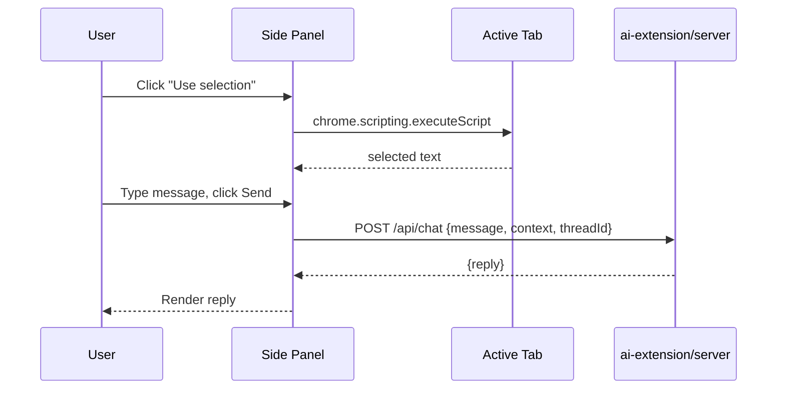

# User Manual

This is a walkthrough of using every user-facing part of this repo: the voice-AI web UI at
`http://localhost:3000`, the `ai-extension` Chrome extension, and the WhatsApp bot (`whatsap`,
plus its `devices-ui` device-management UI). For raw API usage against the backend services
directly, see [`api.md`](./api.md). For environment/configuration options, see
[`config.md`](./config.md).

## 0. Running the project

The easiest way to run everything is Docker Compose, from the repo root:

```bash
docker compose up --build
```

This builds and starts three services by default (`stt` — the Whisper engine — is opt-in; see below):

| Service | URL | Purpose |
|---|---|---|
| `ui` | http://localhost:3000 | The web app described below |
| `tts` | http://localhost:8000 | Text-to-speech backend (Qwen3-TTS) |
| `qwen-stt` | http://localhost:8002 | Speech-to-text backend (Qwen3-ASR) |

Once the containers are up, open **http://localhost:3000** in your browser and continue with
[§1 below](#1-synthesizing-speech). In the transcribe form's Engine selector, only "Qwen" will work
out of the box — see below for enabling "Whisper" too.

Notes:

- The backend services require an NVIDIA GPU with `nvidia-container-toolkit` installed (their
  `docker-compose.yml` entries request `nvidia` GPU devices). For CPU-only machines, see the CPU build
  instructions in [`config.md`](./config.md).
- **GPU memory is tight on smaller cards.** On a 12GB-class GPU, `tts` + `qwen-stt` + `stt` (Whisper)
  don't all fit at once, so `stt` is defined as an opt-in Compose profile and isn't started by default.
  To use Whisper instead of Qwen3-ASR, free up `qwen-stt`'s VRAM first:
  ```bash
  docker compose stop qwen-stt
  docker compose --profile whisper up -d stt
  ```
  See [`config.md`](./config.md#gpu-memory-budget-stt-is-opt-in) for measured VRAM usage per service and
  more on this trade-off (it also explains why voice cloning is disabled by default in this repo's
  compose file — freeing VRAM for `qwen-stt`).
- First startup is slow — model weights are downloaded and loaded into GPU memory, which can take a few
  minutes. Each backend's healthcheck has a 300s grace period for this; check progress with
  `docker compose ps` or `docker compose logs -f tts qwen-stt`. The UI form will show connection
  errors until the backend(s) it needs are ready.
- Model weights and cloned voices persist across restarts in the `models/` and `voices/` folders at the
  repo root (bind-mounted into the containers) — you don't need to re-download or re-clone after a
  `docker compose down`/`up`.
- To stop everything: `docker compose down` (add `-v` only if you also want to discard anonymous
  volumes; the bind-mounted `models/`/`voices/` folders are unaffected either way since they live on
  the host).

### Running the UI only, without Docker

Useful if the backend services are already running elsewhere (another machine, already-running
containers, etc.) and you just want to iterate on the UI:

```bash
cd ui
npm install
npm run dev
```

By default this expects the backends on `localhost:8000`/`8001`/`8002`. If they're elsewhere, set
`TTS_URL`, `STT_URL`, and `QWEN_STT_URL` before running `npm run dev` (see
[`config.md`](./config.md#ui-nuxt-3) for details), for example:

```bash
TTS_URL=http://localhost:8000 STT_URL=http://localhost:8001 QWEN_STT_URL=http://localhost:8002 npm run dev
```

## 1. Synthesizing speech

1. Open the app. The main form is shown at the top of the page.
2. Type the text you want spoken into the **Text** box (up to 4000 characters).
3. Choose a **Speaker** — the dropdown lists the nine preset voices under "Presets", plus any voices
   you've cloned under "Cloned" (see [§3](#3-cloning-a-voice)).
4. Choose a **Language**, or leave it as `Auto` to let the model infer it from the text.
5. Optionally, add a short **Instruction** (e.g. `Very happy.`, `Speak slowly and calmly.`) to steer the
   delivery style. This only applies to preset speakers.
6. Click **Synthesize**. While generating, the button shows "Synthesizing…" and is disabled.
7. When done, an audio player appears below the form and playback starts automatically. You can replay,
   pause, or download it from the player controls.
8. If synthesis fails (e.g. unknown speaker, backend unavailable), an error message appears below the
   form describing what went wrong.

## 2. Transcribing speech

1. Click **Transcribe speech** to expand that section.
2. Provide audio one of two ways:
   - **Upload**: click the file picker and choose an audio file.
   - **Record**: click **Record**, allow microphone access when prompted, speak, then click **Stop**.
     The recorded clip's size and format are shown once captured.
3. Choose the **Engine**:
   - **Whisper** — supports both transcription and translation to English.
   - **Qwen** — transcription only (the Task selector is automatically locked to "Transcribe").
4. Choose a **Language** (or leave "Auto-detect") and, for Whisper, a **Task**
   (Transcribe / Translate to English).
5. Click **Transcribe**. The button reads "Transcribing…" while in progress.
6. The resulting transcript appears in an editable text box — you can correct it by hand if needed.
7. Click **Use as synthesis input** to copy the transcript into the main **Text** field above, so you can
   immediately re-synthesize it (e.g. in a different voice or language).
8. Errors (empty/too-short audio, decode failures, backend unavailable) are shown below the form.

## 3. Cloning a voice

1. Click **Clone a new voice** to expand that section.
2. Provide ~3–10 seconds of **clean** reference speech, either by uploading a file or recording via the
   **Record** button (same flow as transcription above).
3. Type the **exact transcript** of what is said in the reference audio into the **Reference transcript**
   field — accuracy here directly affects clone quality.
4. Optionally set a custom **Voice ID** (letters, digits, `_`, `-`; up to 64 characters). Leave blank to
   get an auto-generated id like `clone-a1b2c3d4`. You cannot reuse a preset speaker's name.
5. Click **Clone voice**. The button reads "Cloning…" while processing (this involves a model inference
   call and may take a few seconds).
6. On success, a confirmation message shows the assigned voice id, the voice list refreshes, and the new
   voice is automatically selected as the active **Speaker** in the synthesis form above — ready to use
   right away.
7. On failure (e.g. audio too short, invalid id, cloning disabled on the server), an error message
   explains why.

Cloned voices persist across server restarts — you don't need to re-clone them each session. To remove
one, use the API directly (`DELETE /voices/{voice_id}` on the TTS service — see [`api.md`](./api.md)); the
UI does not currently expose a delete button.

## Tips

- Recording requires the browser tab to be served over HTTPS or `localhost` — microphone access will be
  blocked otherwise.
- If a request fails immediately with a connection error, confirm the relevant backend container is
  healthy (`docker compose ps`) — model loading can take a few minutes on first startup.
- Switching the STT **Engine** to Qwen mid-session automatically resets **Task** to "Transcribe"; switch
  back to Whisper if you need translation.

## Using ai-extension

1. Click the "AI Page Assistant" toolbar icon to open the side panel.
2. Optionally click **Use selection** (after highlighting text on the page) or **Use
   page** to attach context — it appears as a chip above the input. Neither button talks
   to the server by itself; they only grab text locally.
3. Type a message (e.g. "critically review this") and press **Send** — this is the only
   step that sends anything to `ai-extension/server`. The agent may call its web-search
   tool if your message needs current information, not just the attached page.
4. The attached context is cleared after each send; attach again for the next message if
   needed.
5. Replies render as Markdown (headings, lists, code blocks, links).

If **Use selection**/**Use page** shows a red error instead of a chip, it'll say why. The
extension requests broad `http(s)://*/*` host permissions (see
[`config.md`](./config.md)) specifically so these buttons work reliably on any page —
`activeTab` alone isn't sufficient once the click happens inside the side panel rather
than directly on the toolbar icon.

## Using the WhatsApp bot

Requires the `docker-compose-whatsap.yml` stack running (`docker compose -f
docker-compose-whatsap.yml up --build` — see [`config.md`](./config.md) for the full service
breakdown and required env vars). Every interaction happens inside WhatsApp itself, once a
device is linked.

### Managing WhatsApp devices

A "device" is one WhatsApp account/phone linked to the bot; you can link more than one at a time.

1. Open **http://localhost:3003** (the `devices-ui` service).
2. The device list shows every linked device with its name, label, and status
   (`pending` / `connected` / `disconnected`).
3. To add one: fill in **Name** (lowercase letters, numbers, dashes — used as the folder name
   under `whatsap/devices/`) and **Label** (a friendly display name), then click **Add Device**.
4. You're taken to that device's page, showing a QR code. On the phone you want to link, open
   **WhatsApp → Settings → Linked Devices → Link a Device** and scan it.
   - The QR expires after about a minute — click **Refresh QR code** if scanning fails.
   - The page polls status every 2 seconds and switches to "✅ Connected" automatically once
     scanning succeeds — no manual refresh needed.
   - **If you don't scan within about a minute, the device gives up and flips to
     "❌ Disconnected"** rather than sitting on a stale QR forever — see below for getting it
     back.
5. Alternatively, skip the UI and watch the `whatsap` container's logs
   (`docker compose -f docker-compose-whatsap.yml logs -f whatsap`) — each device's QR is also
   printed to the terminal, prefixed with its device name.

Once connected, a device's session persists across restarts (`whatsap/devices/<name>/session`) —
you only need to re-scan if that session is explicitly removed or WhatsApp invalidates it.

### Reconnecting a disconnected device

A device shows "❌ Disconnected" on its page when its WhatsApp Web session drops — the
one-minute unscanned-QR timeout above, an unlinked/logged-out phone, or a lost connection. Click
**Reconnect** to bring it back:

- If the on-disk session is still valid (e.g. a transient network blip), it reconnects straight
  to "✅ Connected" with no QR needed.
- Otherwise, a fresh QR appears — scan it the same way as when the device was first added.

### Chatting with the bot

Send messages to/from a linked device's WhatsApp account, prefixed with `@ai`:

1. `@ai help` — see the full command list at any time.
2. `@ai <message>` — talk to the default agent, e.g. `@ai what's a good weeknight dinner using
   chicken and rice?`.
3. Attach or quote an image, or send a voice note, along with (or instead of) text — the agent
   sees the image or hears the transcribed audio.
4. `@ai clear session` — forget the conversation so far in this chat and start fresh.
5. `@ai list channels` — list every chat the bot can see, by display name (useful for setting
   `STT_ALLOWED_CHATS`, see [`config.md`](./config.md)).

Voice notes sent to an allow-listed chat (`STT_ALLOWED_CHATS`, default `@jlabrada71`) are
transcribed and forwarded to the default agent automatically — no `@ai` prefix needed.

### Talking to a named agent

Named agents are specialized personas (a math tutor, an interview coach, etc.) with their own
system prompt and tools — see [`features.md`](./features.md#whatsapp-bot-whatsap) for the full
list.

1. `@ai list agents` — see which named agents are configured.
2. `@ai @agent <agent name> [message]` — start or continue a conversation with that agent, e.g.
   `@ai @agent math-coach I want to practice fractions`.
3. Each named agent keeps its own conversation memory per chat, separate from the default agent
   and from other named agents — `@ai clear session` resets all of them together for that chat.

### Scheduling tasks

1. `@ai schedule <describe the task and when it should run>` — e.g. `@ai schedule every Monday
   at 9am, remind me to submit my timesheet`. This is handled by the `task-scheduler` named
   agent, which figures out the cron/one-off timing and confirms what it scheduled.
2. `@ai list tasks` — see every active scheduled task for this device.
3. `@ai cancel task <name>` — cancel one (the name comes from the confirmation message or
   `@ai list tasks`'s listing).

When a task fires, its result is delivered back to the WhatsApp chat it was scheduled from,
without you needing to be present.


